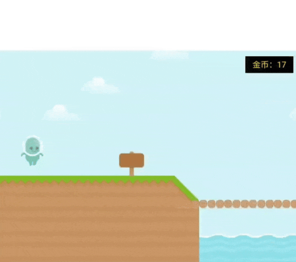
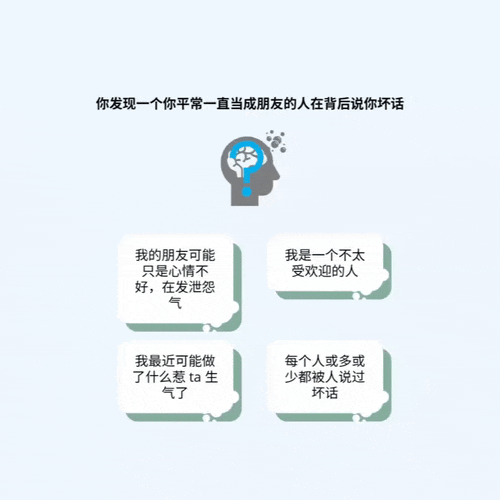

# CBT Tasks (Chinese Adaptation)

This repository contains a **localized and adapted version** of two cognitive tasks originally developed by Norbury et al. (2024, *Science Advances*) to study how components of cognitive-behavioral therapy (CBT) affect underlying cognitive mechanisms.
This adaptation includes full **Chinese localization**, **interface redesign**, and integration with a custom backend (not included in this demo) 
for use in clinical populations (depression and schizophrenia).

🧩 **Original paper:**  
Norbury, A., Hauser, T. U., Fleming, S. M., Dolan, R. J., & Huys, Q. J. M. (2024).  
*Different components of cognitive-behavioral therapy affect specific cognitive mechanisms.*  
*Science Advances, 10*, eadk3222. [DOI: 10.1126/sciadv.adk3222](https://doi.org/10.1126/sciadv.adk3222)

---

## Overview

Two experimental tasks are included:

1. 🎯 **Goal-Setting Game** — a gamified reward–effort decision-making task based on behavioral activation therapy.  
2. 💭 **Causal Attribution Task** — a scenario-based attribution task based on cognitive restructuring therapy.

These tasks were adapted and extended for **Chinese-speaking participants** and are used to study **cognitive and behavioral mechanisms of CBT** in **depression and schizophrenia**.

---

## My Contributions
- Translated and localized all task interfaces and instructions into **Chinese**, ensuring cultural and linguistic accuracy for participant comprehension.  
- Developed a **LeanCloud-based backend system** for secure behavioral data storage and experiment management.  
- Adapted both experimental tasks for research use with **clinical populations** (depression and schizophrenia), enabling cross-cultural investigation of CBT-related cognitive mechanisms.

---

## Task demonstrations

🔗 **Demo links:**  
- Original (English): [Reward–Effort Task](https://modcomp-i1.web.app/) · [Attribution Task](https://modcomp-ca2.web.app/)  
- Adapted (Chinese): https://xyzhang2312.github.io/cbt-test-cn/
---

###  1. Menu and Participant Info Page

This demo shows the initial interface where participants select between tasks  
and (in the research version) provide demographic information before beginning.  
The public demo version disables data submission for privacy.

---

###  2. Goal-Setting Game

This task assesses **reward–effort decision-making**.  
Participants decide whether to exert effort for potential rewards, learning optimal strategies through feedback.  
The animation below illustrates a sample trial.

---

###  3. Causal Attribution Task

This task measures **attributional style** by presenting positive and negative scenarios.  
Participants choose likely causes for each event, revealing cognitive patterns related to self vs. external attribution.  
The demo below shows an example instruction page and trial sequence.

---

> ⚠️ *Note:* These animations are for demonstration only and contain English annotations.  
> No behavioral data are collected in this public version.  
> Each task is fully implemented with timing precision and response handling in the research version.

---

## Tech Stack

**Frontend:** JavaScript (Phaser 3), HTML5  
**Backend:** LeanCloud (JavaScript SDK / REST API)  
**Deployment:** GitHub Pages + LeanCloud cloud functions

---

## Acknowledgment

Original design and theoretical framework by **Norbury et al. (2024)**, University College London.  
Original open-source code: [agnesnorbury/cognitive-mechanisms-psychotherapy](https://github.com/agnesnorbury/cognitive-mechanisms-psychotherapy).  
This adaptation is for educational and research demonstration purposes only.
